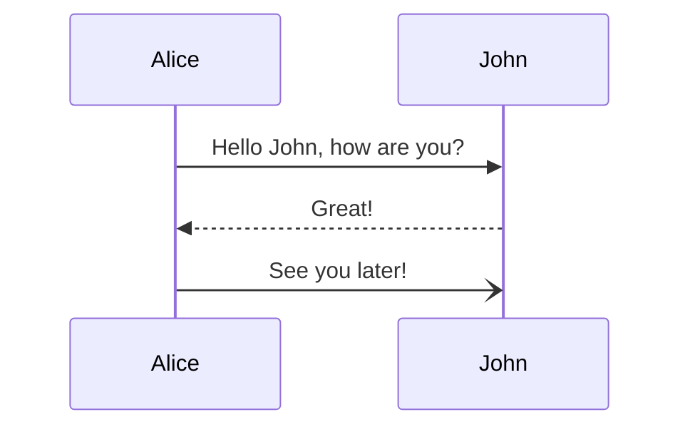

Welcome to Chapter 2! Now that you understand the basics from the previous chapter, we'll explore more advanced topics and techniques. This chapter builds upon the foundation we established earlier.

## Advanced Concepts

As you become more comfortable with the fundamentals, you'll want to explore more sophisticated approaches. This section covers advanced patterns and best practices that will take your skills to the next level.

### Complex Scenarios

Real-world applications often involve complex scenarios that require careful consideration. Here are some key points to keep in mind:

- Always consider edge cases and error handling
- Think about scalability from the beginning
- Document your decisions and reasoning
- Test thoroughly before deploying

### Performance Considerations

Performance becomes increasingly important as your projects grow. Here are some strategies for optimization:

1. Profile before optimizing - measure what actually needs improvement
2. Focus on algorithmic improvements first
3. Consider caching strategies for frequently accessed data
4. Optimize for the common case, not edge cases

## Deep Dive

Let's explore some specific topics in greater detail. Understanding these concepts will help you make better architectural decisions.

### Architecture Patterns

Choosing the right architecture pattern is crucial for long-term maintainability. Consider these factors:

> The best architecture is the one that fits your specific needs and constraints. Don't blindly follow trends - understand the trade-offs.

Common patterns include:

- **Layered Architecture** - Separates concerns into distinct layers
- **Microservices** - Distributes functionality across independent services
- **Event-Driven** - Uses events to trigger and communicate between services
- **Monolithic** - Single unified codebase (not always bad!)

### Code Organization

As projects grow, code organization becomes critical. Here are some principles to follow:

- Group related functionality together
- Keep modules focused and cohesive
- Minimize dependencies between modules
- Use clear naming conventions

## Practical Examples

Theory is important, but practical examples help solidify understanding. Let's look at some real-world scenarios.

### Example 1: Error Handling

Proper error handling is essential for robust applications. Consider using structured error types and providing meaningful error messages. For example: `throw new ValidationError('Invalid input')`

### Example 2: State Management

Managing state effectively prevents bugs and makes code easier to reason about. Consider immutable data structures and unidirectional data flow patterns.

## Common Pitfalls

Learn from common mistakes to avoid them in your own projects:

1. Premature optimization - Don't optimize before you have data
2. Over-engineering - Keep solutions as simple as possible
3. Ignoring edge cases - They will find you eventually
4. Poor error handling - Fail gracefully and provide useful feedback

## Summary

You should now have a solid understanding of advanced concepts and how to apply them. The key is to balance theoretical knowledge with practical experience.

In the next chapter, we'll cover best practices that tie everything together and help you write production-ready code.
